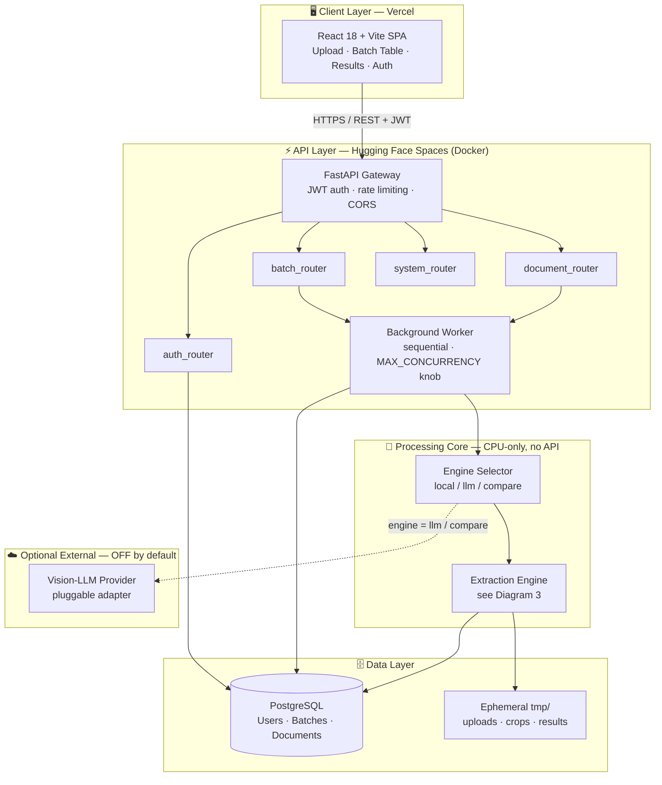
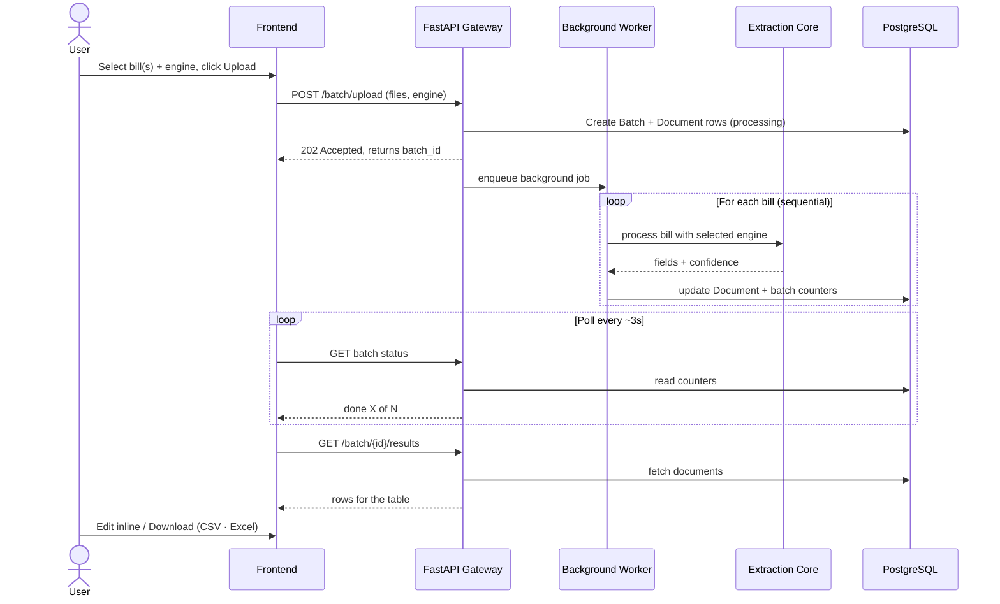
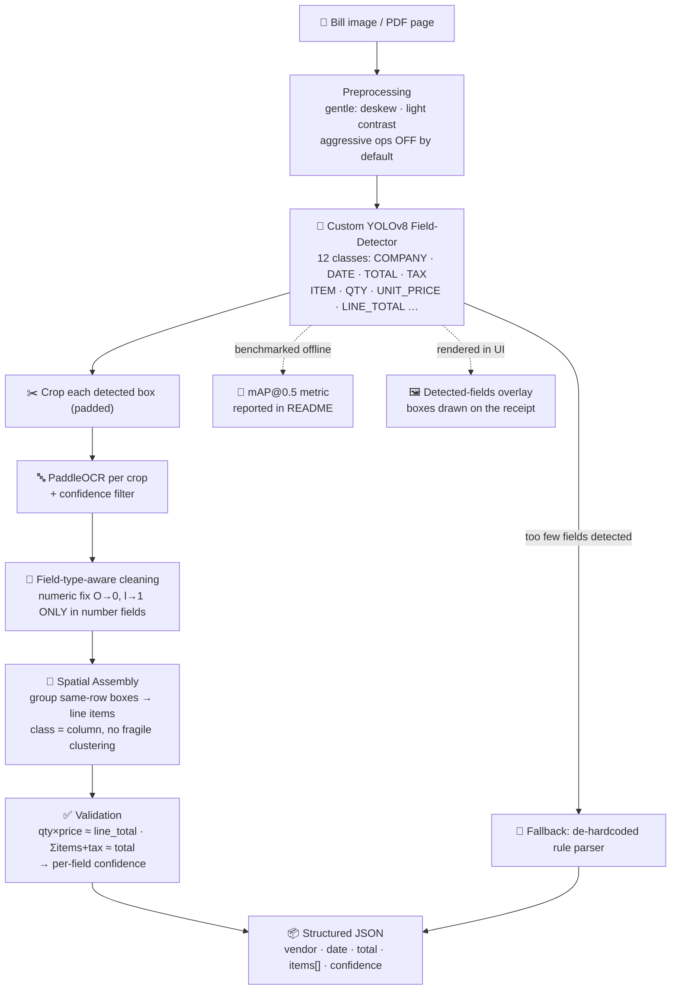
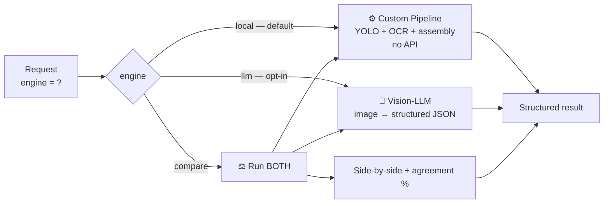
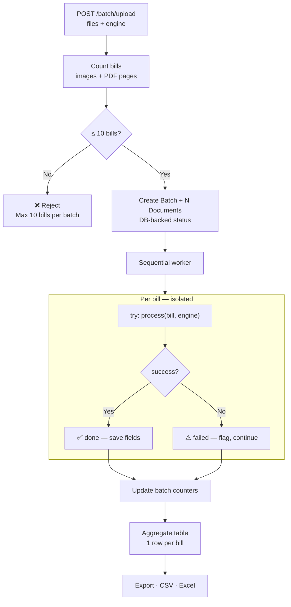
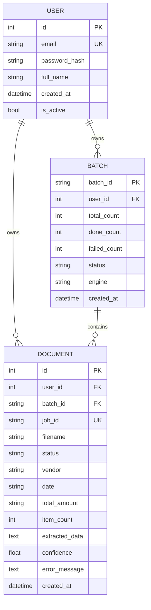
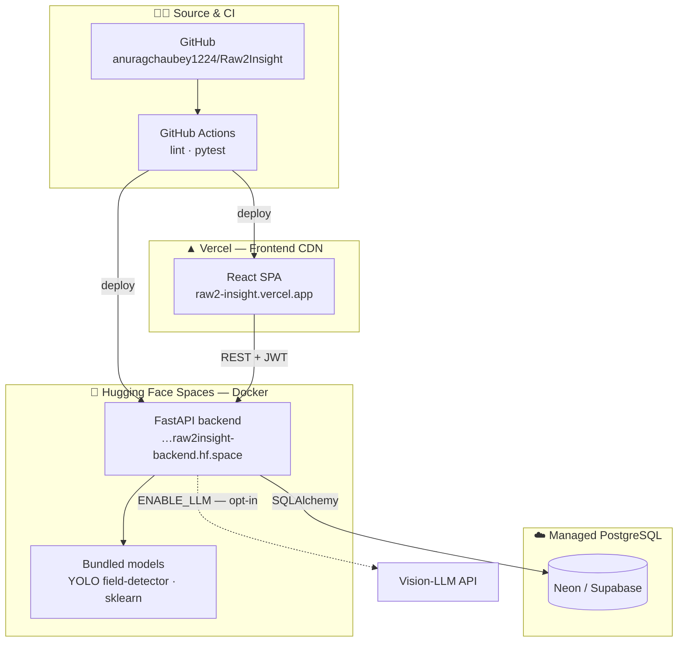

# Raw2Insight — System Architecture

> **AI-powered document-intelligence platform** that turns receipts/invoices into structured,
> downloadable data. This document describes the **target architecture** being implemented
> (see [`IMPLEMENTATION_PLAN.md`](./IMPLEMENTATION_PLAN.md)); the reasoning behind each choice lives
> in [`DESIGN_DECISIONS.md`](./DESIGN_DECISIONS.md).

The core extraction runs **entirely on CPU with no external API** — a custom-trained YOLOv8 field
detector + PaddleOCR + a spatial-assembly algorithm. A Vision-LLM is available as an **optional,
opt-in** engine, never a dependency.

---

## Design principles

| Principle | What it means |
|-----------|---------------|
| 🔁 **Additive / backward-compatible** | New features never break the live deployment; existing endpoints keep working |
| 🧠 **Local-first core** | The real extraction work runs on CPU with no API calls |
| 🔌 **Pluggable engine** | Users choose `local` ML, optional `llm`, or `compare` mode at request time |
| 📏 **Measured** | Every accuracy claim is backed by a benchmark (mAP, field accuracy) |
| 🛡️ **Reliable** | DB-backed job state (survives restarts) + per-item failure isolation |

**Legend:** solid arrows = always-on data flow · dashed arrows = optional / off-by-default.

---

## Tech stack

| Layer | Technology |
|-------|-----------|
| Frontend | React 18, Vite, React Router, Tailwind CSS, Axios |
| Backend | FastAPI, SQLAlchemy, JWT (bcrypt), SlowAPI rate limiting |
| ML / CV | **Custom YOLOv8 field-detector**, PaddleOCR, OpenCV, scikit-learn |
| Optional | Pluggable Vision-LLM adapter (off by default) |
| Data | PostgreSQL (Neon/Supabase), ephemeral `tmp/` for crops/results |
| Infra | Hugging Face Spaces (Docker) · Vercel · GitHub Actions CI |

---

## 1. System architecture (high level)

The platform is a classic three-tier system (client → API → data) with a dedicated **CPU-only
processing core** and an **optional external LLM** that is wired in but disabled by default.

**Notes**
- The **Background Worker** decouples slow ML processing from the HTTP request → the API responds
  instantly with a `batch_id` and the client polls for progress.
- The **LLM** sits behind the Engine Selector and is reached only when the user opts in.

---

## 2. Request & data flow

Upload is non-blocking: the API persists job state, kicks off background processing, and the client
polls until the batch completes.

---

## 3. Extraction core ⭐ (the real work)

This is the heart of the project and the main differentiator. Instead of guessing columns from raw
OCR text (the old brittle approach), a **custom-trained detector labels each field's class**, so the
class itself tells us what every value is — `QTY`, `UNIT_PRICE`, `LINE_TOTAL`, `TOTAL`, etc.

**Why this is accurate (and not just rules):**
1. **Detector knows the field class** → no column guessing.
2. **Crop-then-OCR** → OCR reads a small clean region, far more reliable than full-image OCR.
3. **Field-type-aware cleaning** → numeric corrections are applied *only* inside number fields.
4. **Math cross-checks** → catch OCR errors and produce a confidence score per field.

See [`IMPLEMENTATION_PLAN.md` › Appendix A](./IMPLEMENTATION_PLAN.md) for the full accuracy playbook.

---

## 4. Pluggable processing engine

A request-time `engine` parameter routes processing. The default is the local ML pipeline; the LLM is
strictly opt-in. `compare` runs both and is the demo centerpiece — it visually proves the custom
pipeline matches a state-of-the-art VLM.

---

## 5. Batch processing

The product feature: many bills in, one table out. Bills are processed **sequentially** (the correct
choice for CPU-bound ML on a 2-vCPU box — see `DESIGN_DECISIONS.md` §3) with **per-item isolation** so
one bad slip never fails the whole batch.

> **Backward compatibility:** single upload is internally a *batch of 1* sharing the same core, so the
> existing `/upload`, `/status`, `/result`, `/download` endpoints stay fully functional.

---

## 6. Data model

The `BATCH` table is the new addition that turns a per-file system into a grouped, product-grade one.
Job/batch status lives **in the database** (not an in-memory dict) so it survives Hugging Face Space
restarts and sleeps.

---

## 7. Deployment topology

**Free-tier aware:** the backend is CPU-only, so the architecture keeps heavy work bounded
(sequential processing, lightweight YOLO-nano) and treats `tmp/` as ephemeral — the database is the
single source of truth.

---

## Where to go next

- **Reasoning & decisions:** [`DESIGN_DECISIONS.md`](./DESIGN_DECISIONS.md)
- **Build plan & phases:** [`IMPLEMENTATION_PLAN.md`](./IMPLEMENTATION_PLAN.md)
